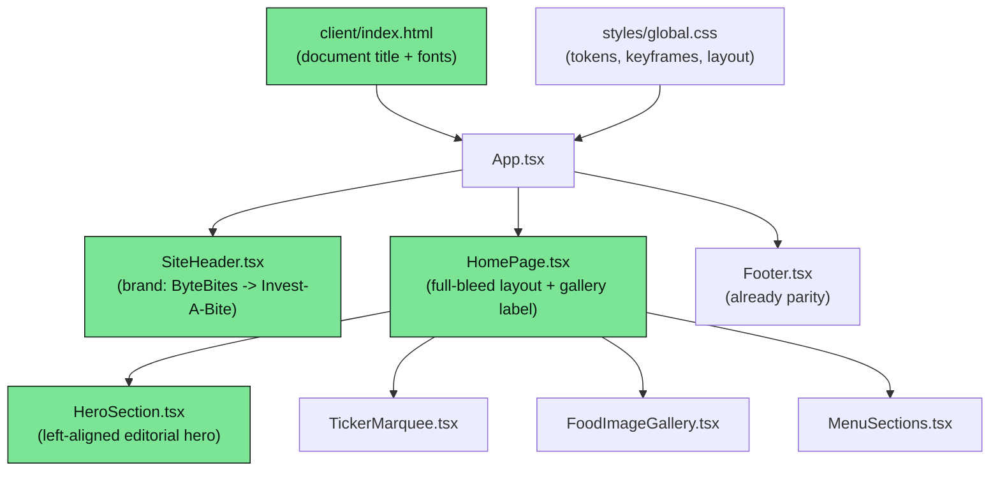

# Design Document: Invest-A-Bite Design Parity

## Overview

The React client under `client/src` already renders an "Invest-A-Bite" landing page whose
palette, fonts, and keyframes broadly match the bundled reference (`client/invest-a-bite-website.html`),
but several surfaces have drifted from the reference: the hero is centered/full-viewport instead of
left-aligned editorial, the badge is missing its solid mint pill and secondary label, the title has a
duplicate orange hyphen, the "board" stats are stacked instead of a horizontal row, the shared brand is
still "ByteBites" in the header and document title, one gallery card uses the wrong food label, and the
gallery/menu are constrained to a centered 1080px column instead of running full-bleed at `6vw`.

This design specifies the visual-parity changes needed to bring the marketing/landing surface and shared
branding in line with the reference, **without** altering backend/domain logic or e-commerce behavior
(cart, checkout, admin). It is a presentation-layer effort: JSX structure, inline style objects, CSS
class rules, static content (brand strings, gallery labels), and the accompanying Vitest tests/snapshots.

The reference is a self-contained artifact for comparison only and is never imported or wired into the app.

## Goals and Non-Goals

**Goals**
- Bring the hero, gallery, menu, footer, and shared header/branding into visual parity with the reference.
- Preserve accessibility: visible focus, sufficient contrast, and `prefers-reduced-motion` handling.
- Keep existing Vitest suites green, updating tests/snapshots where markup or copy changes.

**Non-Goals**
- No changes to cart, checkout, admin, wallet, referral, or any domain/server logic.
- No new features, routes, or data fetching.
- Not wiring the reference HTML bundle into the running app.

## Architecture

The landing page is composed from presentational React components rendered by `HomePage`. Shared chrome
(`SiteHeader`, `Footer`) and global CSS (`styles/global.css`) provide branding and design tokens. The
parity work touches only the shaded nodes below.



### Reference Page Structure (source of truth)

All full-bleed sections use `6vw` horizontal padding.

1. **Header hero** — left-aligned editorial (`padding: 88px 6vw 72px`, flex column, `gap: 30px`):
   badge row with a solid mint pill (`#7BE495` bg, `#0F1D17` text, `padding: 9px 18px`, `border-radius: 999px`)
   containing a blinking dark dot + "Now trading" (uppercase, `letter-spacing: 0.14em`), plus a muted
   uppercase label "Food stall · Fresh all day"; `h1` "Invest-A" + orange "-" + "Bite"
   (Anton, `clamp(56px,11vw,168px)`, `line-height: 0.92`); mint tagline
   "High returns on every bite. Zero risk, all flavour." (`clamp(20px,2.4vw,34px)`, weight 500, `max-width: 22ch`);
   a horizontal stats row (flex, `gap: 36px`): "Today's board" + "₹15–80" (Anton `clamp(38px,5vw,62px)`)
   and "▲ Market open" (mint). Two decorative radial-gradient glow orbs (green top-right, gold bottom-left)
   animated with `ia-glow`.
2. **Ticker marquee** — mint bar, `#0B1712` text, 4px dark top/bottom borders, `ia-marquee 26s linear infinite`,
   Anton 26px, items like "▲ Mint Mojito 50", duplicated for a seamless loop.
3. **Food image gallery** — `grid` `repeat(auto-fit, minmax(300px,1fr))`, `gap: 22px`, `padding: 26px 6vw 0`;
   three cards (`aspect-ratio: 4/3`, `border-radius: 24px`, 3px accent border, `ia-float 7s` staggered):
   Momos (gold), Basket Chaat (green), Mint Mojito (purple); bottom-left uppercase pills.
4. **Menu sections** — `grid` `repeat(auto-fit, minmax(340px,1fr))`, `gap: 44px 56px`, `padding: 64px 6vw 84px`;
   sections Blue-Chip Mojitos (gold), High-Yield Shots (purple), Hot Assets (gold), Cool Dividends (green),
   plus a full-width (`grid-column: 1/-1`) "Chaat Portfolio" bonus card; Anton 30px accent headings with a
   trailing 2px accent rule; item rows use a dotted leader between name (Space Grotesk 22px) and price
   (Anton 26px); rows hover to `rgba(246,239,226,0.06)` + `translateX(6px)`; scroll-reveal via `[data-reveal]`.
5. **Footer** — top border `3px rgba(246,239,226,0.14)`, `padding: 40px 6vw 56px`, flex space-between:
   "Invest-A-Bite" (Anton 30px, orange hyphen) left, "Fresh all day · Cash & UPI" (uppercase, muted) right.

## Design Tokens (already present in `global.css`)

| Token | Value | Usage |
| --- | --- | --- |
| `--ia-bg` | `#0F1D17` | page background |
| `--ia-text` | `#F6EFE2` | primary text |
| `--ia-text-muted` | `rgba(246,239,226,0.6)` | muted labels |
| `--ia-green` | `#7BE495` | mint accents, pill bg, tagline, status |
| `--ia-gold` | `#FFB43A` | links, hyphen, gold accents (hover `#FFD489`) |
| `--ia-purple` | `#C79BFF` | purple accents |
| dark-on-light | `#0B1712` | text on mint surfaces |
| `--ia-font-display` | `'Anton', 'Arial Black', sans-serif` | headings |
| `--ia-font-body` | `'Space Grotesk', ...` | body |

Keyframes present: `ia-rise`, `ia-fade`, `ia-marquee`, `ia-float`, `ia-glow`, `ia-blink`,
with a `prefers-reduced-motion: reduce` block disabling animation.

## Components and Interfaces

### Component: `HeroSection` (`client/src/pages/HeroSection.tsx`)

**Purpose**: Left-aligned editorial hero matching the reference header.

**Interface**: No props (self-contained).

```tsx
export function HeroSection(): JSX.Element
```

**Parity responsibilities**:
- Container: `padding: 88px 6vw 72px`, `display: flex`, `flexDirection: column`, `alignItems: flex-start`,
  `gap: 30px`, `textAlign: left`; remove `minHeight: calc(100vh - 60px)` and centering.
- Badge row (flex, `gap: 18px`, `align-items: center`, wraps): a solid mint **pill**
  (`background: #7BE495`, `color: #0F1D17`, `padding: 9px 18px`, `borderRadius: 999px`, uppercase,
  `letterSpacing: 0.14em`) containing a blinking dark dot (`background: #0F1D17`, `ia-blink`) + "Now trading";
  plus a muted uppercase secondary label "Food stall · Fresh all day".
- Title `h1`: "Invest-A" + `<span style={{color:'#FFB43A'}}>-</span>` + "Bite" (a **single** orange hyphen),
  Anton, `clamp(56px,11vw,168px)`, `lineHeight: 0.92`, left-aligned.
- Tagline: mint (`#7BE495`), `clamp(20px,2.4vw,34px)`, `fontWeight: 500`, `maxWidth: 22ch`.
- Stats row: horizontal flex (`gap: 36px`, `align-items: baseline`, wraps): a "Today's board" group
  ("Today's board" muted uppercase label above "₹15–80" in Anton `clamp(38px,5vw,62px)`) and
  "▲ Market open" in mint.
- Two decorative glow orbs retained (`aria-hidden`, `pointer-events: none`, `ia-glow`).

### Component: `HomePage` (`client/src/pages/HomePage.tsx`)

**Purpose**: Composes the landing sections and provides the full-bleed layout.

```tsx
export function HomePage(): JSX.Element
```

**Parity responsibilities**:
- Remove the centered `maxWidth: 1080px` wrappers around `FoodImageGallery` and `MenuSections`.
- Gallery wrapper padding: `26px 6vw 0`; menu wrapper padding: `64px 6vw 84px` (full-bleed at `6vw`).
- Update the middle gallery item from "Pani Puri" to **"Basket Chaat"** (label + `category`), with a
  representative image URL.
- Menu/ticker/section content data remains otherwise unchanged.

### Component: `FoodImageGallery` (`client/src/pages/FoodImageGallery.tsx`)

**Purpose**: Renders the three-card food gallery.

```tsx
interface GalleryItem {
  name: string;
  imageUrl: string;
  category: string;
  accentColor: string; // hex; border rendered at 0.35 alpha
}
interface FoodImageGalleryProps { items: GalleryItem[] }
export function FoodImageGallery(props: FoodImageGalleryProps): JSX.Element
```

**Parity responsibilities**:
- Grid min-column widens to `minmax(300px, 1fr)` with `gap: 22px` (align the `.ia-gallery-grid` rule and/or
  inline style to the reference). Card visuals (aspect ratio, border, pill) already match.

### Component: `MenuSections` (`client/src/pages/MenuSections.tsx`)

**Purpose**: Renders investment-themed menu categories and the bonus Chaat Portfolio card.

```tsx
interface MenuItem { name: string; price: number; subtitle?: string }
interface MenuSection {
  title: string;
  accentColor: string;
  items: MenuItem[];
  isBonus?: boolean;
  bonusText?: string;
}
interface MenuSectionsProps { sections: MenuSection[] }
export function MenuSections(props: MenuSectionsProps): JSX.Element
```

**Parity responsibilities**:
- Grid min-column widens to `minmax(340px, 1fr)` with `gap: 44px 56px` to match the reference.
- Existing heading rule, dotted leader, hover translate, and full-width bonus card already match; verify only.

### Component: `SiteHeader` (`client/src/pages/SiteHeader.tsx`)

**Purpose**: Shared sticky navigation with brand.

```tsx
export function SiteHeader(): JSX.Element
```

**Parity responsibilities**:
- Replace brand text "ByteBites" with **"Invest-A-Bite"** in both the desktop `.site-brand-name` and the
  mobile `.sidebar-brand`.
- Update the brand link `aria-label` from "ByteBites home" to "Invest-A-Bite home".
- The decorative `🍽` mark and all navigation/routing behavior are unchanged.

### Non-component surface: `client/index.html`

**Parity responsibilities**:
- Update `<title>` from "ByteBites — ..." to an Invest-A-Bite title (e.g. "Invest-A-Bite — Invest in Taste.
  Earn in Happiness."). Font `<link>` tags are already correct.

### Component: `Footer` (`client/src/pages/Footer.tsx`)

Already matches the reference (brand left, tagline right, correct borders/padding). Verify only; no change expected.

## Data Models

Static, in-file content only — no persisted or fetched models change.

### `galleryItems` (in `HomePage.tsx`)

```tsx
const galleryItems: GalleryItem[] = [
  { name: "Momos",        imageUrl: "<url>", category: "Momos",        accentColor: "#FFB43A" },
  { name: "Basket Chaat", imageUrl: "<url>", category: "Basket Chaat", accentColor: "#7BE495" }, // was "Pani Puri"
  { name: "Mint Mojito",  imageUrl: "<url>", category: "Mint Mojito",  accentColor: "#C79BFF" },
];
```

**Validation rules**:
- Exactly three cards, in order: Momos (gold), Basket Chaat (green), Mint Mojito (purple).
- `category` (the visible pill label) equals the intended reference label for each card.
- `accentColor` is a 7-char hex string; the border is rendered at alpha 0.35 of that color.

### Brand constant (conceptual)

- Displayed brand string across header/sidebar/footer/title MUST be "Invest-A-Bite" (never "ByteBites").

## Correctness Properties

*A property is a characteristic or behavior that should hold true across all valid executions of a system —
essentially, a formal statement about what the system should do. Properties serve as the bridge between
human-readable specifications and machine-verifiable correctness guarantees.*

### Property 1: Brand consistency

For all rendered landing/chrome surfaces (desktop header, mobile sidebar, footer, document title), the
displayed brand string is "Invest-A-Bite" and the string "ByteBites" never appears.

**Validates: Requirements 1.1, 1.2, 1.3, 1.4, 1.5**

### Property 2: Single gold hyphen in hero title

For the hero title, exactly one hyphen character is styled with the gold accent color, and the accessible
heading name resolves to "Invest-A-Bite".

**Validates: Requirements 4.1, 4.2**

### Property 3: Gallery labels match reference set

For all rendered gallery cards, the set of visible category labels equals {Momos, Basket Chaat, Mint Mojito},
and "Pani Puri" never appears.

**Validates: Requirements 7.2, 7.3**

### Property 4: Ticker seamless-loop duplication and formatting

For any non-empty list of `n` ticker items, the marquee renders exactly `2n` item nodes (each source item
appears twice), and every rendered node is formatted as "▲ {name} ₹{price}".

**Validates: Requirements 8.1, 8.3**

### Property 5: Menu row structure

For any menu section, every item row renders both the item name and its price formatted as "₹{price}",
separated by a dotted leader line.

**Validates: Requirements 9.1, 9.2**

### Property 6: Reduced-motion honored

For all animated surfaces, when `prefers-reduced-motion: reduce` is active, continuous animations are disabled
while content remains fully visible and readable.

**Validates: Requirements 3.4, 10.1**

### Property 7: Gallery border color derivation

For any gallery card, the rendered card border color equals the `rgba` conversion of that card's
`accentColor` hex at alpha 0.35.

**Validates: Requirements 7.4**

## Error Handling

This is a presentational surface with static content; runtime error paths are minimal.

- **Empty gallery list**: `FoodImageGallery` renders nothing (empty fragment) rather than throwing.
- **Empty ticker list**: `TickerMarquee` renders `null` rather than throwing.
- **Missing image asset**: broken `imageUrl` degrades to the card background color (`#0F1D17`); layout
  (aspect ratio, border, pill) is preserved and no error is surfaced.

## Testing Strategy

### Unit Testing Approach (Vitest + Testing Library)

- Update `HomePage.test.tsx` to reflect copy/label changes: the middle gallery card asserts
  `getByAltText("Basket Chaat")` (the current test references a stale label and MUST be corrected), and add
  an assertion that "Pani Puri" is absent.
- Add/adjust `SiteHeader` and `Footer` brand assertions to expect "Invest-A-Bite".
- Assert hero structure: presence of the "Now trading" pill text, the secondary
  "Food stall · Fresh all day" label, the single-hyphen accessible title name, "₹15–80", and "▲ Market open".
- Keep all existing non-landing suites green; only touch tests affected by copy/markup/branding changes.

### Property-Based Testing Approach

Property-based testing applies to the small pure/deterministic rendering behaviors that vary with input,
primarily the ticker duplication (Property 4) and menu row rendering (Property 5), which can be exercised
with generated item lists. Brand/label/parity checks (Properties 1–3) are best expressed as example-based
render assertions since the input space is fixed. Reduced-motion (Property 6) is verified via CSS media
query assertions rather than randomized inputs.

**Property Test Library**: fast-check (already a dependency in this workspace).

### Integration Testing Approach

Not required — no cross-service or data-layer behavior changes. The full landing render is covered by the
`HomePage` unit test composition.

## Accessibility Considerations

- Preserve visible focus outlines (existing `:focus-visible` rules in `global.css`).
- Maintain text/background contrast using the established tokens (mint/gold/purple on `#0F1D17`,
  dark text on mint surfaces).
- Honor `prefers-reduced-motion: reduce` — animations (`ia-glow`, `ia-float`, `ia-marquee`, `ia-blink`)
  disabled without hiding content.
- Decorative elements (glow orbs, blinking dot, gallery pills' pointer handling) remain `aria-hidden` /
  non-interactive; the hero title remains a single accessible `h1` reading "Invest-A-Bite".

## Performance Considerations

Negligible. Changes are layout/style/copy only. No new network requests, no added animations beyond those
already present, and the reference bundle is never loaded by the app.

## Dependencies

- Existing runtime deps: `react`, `react-dom`, `react-router-dom`.
- Existing dev/test deps: `vitest`, `@testing-library/react`, `@testing-library/jest-dom`, `jsdom`,
  `fast-check` (available at the workspace root).
- Fonts: Anton + Space Grotesk via Google Fonts `<link>` in `client/index.html` (already present).
- Verification commands: `client/package.json` `test` (`vitest run`) and `build` (`tsc --build && vite build`).
