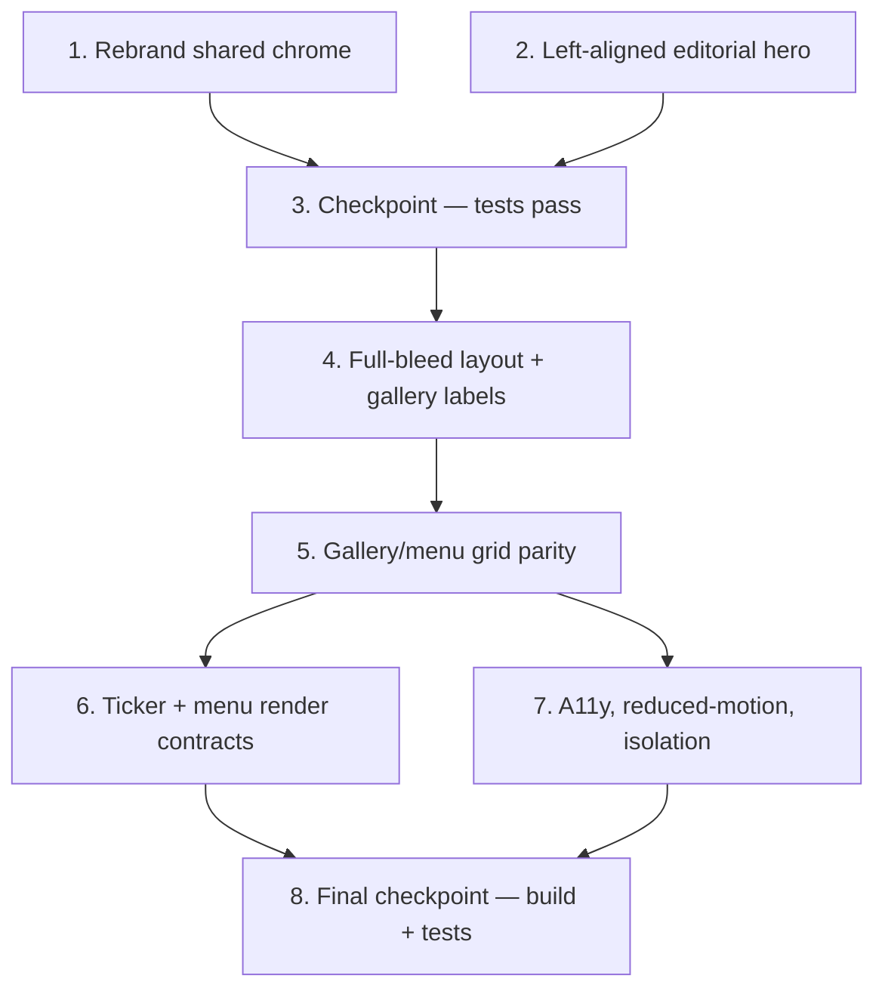

# Implementation Plan: Invest-A-Bite Design Parity

## Overview

Presentation-layer changes only, in TypeScript/React (the client stack). Each task builds incrementally:
first shared branding, then the hero, then the full-bleed layout and gallery labels, then grid parity, then
verification. Property/edge/unit test sub-tasks (marked `*`) validate the design's Correctness Properties and
key examples. No backend/domain/e-commerce logic is touched, and the reference HTML bundle is never imported.

## Task Dependency Graph



```json
{
  "waves": [
    { "wave": 1, "tasks": ["1", "2"] },
    { "wave": 2, "tasks": ["3"] },
    { "wave": 3, "tasks": ["4"] },
    { "wave": 4, "tasks": ["5"] },
    { "wave": 5, "tasks": ["6", "7"] },
    { "wave": 6, "tasks": ["8"] }
  ]
}
```

## Tasks

- [x] 1. Rebrand shared chrome to "Invest-A-Bite"
  - [x] 1.1 Update `SiteHeader.tsx` brand strings and aria-label
    - Change `.site-brand-name` and `.sidebar-brand` text from "ByteBites" to "Invest-A-Bite"
    - Change the brand link `aria-label` from "ByteBites home" to "Invest-A-Bite home"
    - Leave the `🍽` mark, nav links, and routing unchanged
    - _Requirements: 1.1, 1.2, 1.4_
  - [x] 1.2 Update `client/index.html` document title
    - Change `<title>` to an Invest-A-Bite title (e.g. "Invest-A-Bite — Invest in Taste. Earn in Happiness.")
    - _Requirements: 1.3_
  - [ ]* 1.3 Write unit tests for brand consistency
    - Assert desktop + sidebar brand text is "Invest-A-Bite" and brand link aria-label references it
    - Assert `queryByText(/ByteBites/)` is null across header/footer render
    - **Property 1: Brand consistency**
    - **Validates: Requirements 1.1, 1.2, 1.4, 1.5**

- [x] 2. Rework `HeroSection.tsx` into the left-aligned editorial hero
  - [x] 2.1 Convert hero container to left-aligned vertical stack
    - Set `padding: 88px 6vw 72px`, `display: flex`, `flexDirection: column`, `alignItems: flex-start`, `gap: 30px`, `textAlign: left`
    - Remove `minHeight: calc(100vh - 60px)` and center alignment
    - Keep the two `aria-hidden` glow orbs (`pointer-events: none`, `ia-glow`)
    - _Requirements: 2.1, 2.2, 2.3, 2.4_
  - [x] 2.2 Build the badge row with mint pill and secondary label
    - Render a solid mint pill (`background: #7BE495`, `color: #0F1D17`, `padding: 9px 18px`, `borderRadius: 999px`, uppercase, `letterSpacing: 0.14em`) with text "Now trading"
    - Add a blinking dark dot (`background: #0F1D17`, `ia-blink`, `aria-hidden`) inside the pill
    - Add a muted uppercase secondary label "Food stall · Fresh all day"
    - _Requirements: 3.1, 3.2, 3.3, 3.4_
  - [x] 2.3 Fix the hero title to a single gold hyphen
    - Render "Invest-A" + `<span style={{color:'#FFB43A'}}>-</span>` + "Bite" (remove the duplicate hyphen span)
    - Keep display font, uppercase, `clamp(56px,11vw,168px)`, `lineHeight: 0.92`, left-aligned
    - _Requirements: 4.1, 4.2, 4.3_
  - [x] 2.4 Arrange board price and market status as one horizontal row
    - Wrap the "Today's board" + "₹15–80" group and "▲ Market open" in a horizontal flex row (`gap: 36px`, `align-items: baseline`, wraps)
    - Keep "▲ Market open" in mint (`#7BE495`)
    - _Requirements: 5.1, 5.2, 5.3_
  - [ ]* 2.5 Write unit tests for hero structure
    - Assert "Now trading" pill, "Food stall · Fresh all day" label, single gold hyphen (count === 1), accessible title "Invest-A-Bite", "₹15–80", "▲ Market open"
    - **Property 2: Single gold hyphen in hero title**
    - **Validates: Requirements 3.1, 3.3, 4.1, 4.2, 5.1, 5.2**

- [x] 3. Checkpoint — ensure all tests pass
  - Run `vitest run` in `client`; ensure all tests pass, ask the user if questions arise.

- [x] 4. Make the landing layout full-bleed and fix gallery labels in `HomePage.tsx`
  - [x] 4.1 Remove centered 1080px wrappers and apply 6vw padding
    - Replace the gallery wrapper with padding `26px 6vw 0` (no `maxWidth`/centering)
    - Replace the menu wrapper with padding `64px 6vw 84px` (no `maxWidth`/centering)
    - _Requirements: 6.1, 6.2_
  - [x] 4.2 Update the middle gallery item to "Basket Chaat"
    - Change the second `galleryItems` entry `name`/`category` from "Pani Puri" to "Basket Chaat" with a representative image URL; keep green accent `#7BE495`
    - _Requirements: 7.1, 7.2, 7.3, 7.4_
  - [ ]* 4.3 Update `HomePage.test.tsx` for new labels
    - Correct the stale gallery assertion to `getByAltText("Basket Chaat")` and assert `queryByText(/Pani Puri/)` is null
    - Assert the three gallery labels {Momos, Basket Chaat, Mint Mojito}
    - **Property 3: Gallery labels match reference set**
    - **Validates: Requirements 7.1, 7.2, 7.3**

- [x] 5. Align gallery and menu grids to the reference
  - [x] 5.1 Widen gallery grid min-column and gap
    - Ensure `FoodImageGallery` grid uses `repeat(auto-fit, minmax(300px, 1fr))` with `gap: 22px` (align `.ia-gallery-grid` in `global.css` and/or inline style)
    - _Requirements: 6.3_
  - [x] 5.2 Widen menu grid min-column and gap
    - Update `MenuSections` grid to `repeat(auto-fit, minmax(340px, 1fr))` with `gap: 44px 56px`
    - Verify the "Chaat Portfolio" bonus card still spans `grid-column: 1 / -1`
    - _Requirements: 6.4, 9.3, 9.4_
  - [ ]* 5.3 Write property test for gallery border color derivation
    - Generate gallery items with arbitrary hex `accentColor`; assert rendered border equals `rgba(accentColor, 0.35)`
    - **Property 7: Gallery border color derivation**
    - **Validates: Requirements 7.4**

- [ ] 6. Verify ticker and menu rendering contracts
  - [ ]* 6.1 Write property test for the ticker
    - Generate non-empty item lists of length `n`; assert `2n` rendered item nodes, each formatted "▲ {name} ₹{price}"
    - **Property 4: Ticker seamless-loop duplication and formatting**
    - **Validates: Requirements 8.1, 8.3**
  - [ ]* 6.2 Write edge-case + label unit tests for the ticker
    - Assert empty list renders nothing; assert accessible label "Food price ticker"
    - _Requirements: 8.2, 8.4_
  - [ ]* 6.3 Write property test for menu rows
    - Generate menu sections; assert every rendered row shows the name and "₹{price}" separated by a dotted leader
    - **Property 5: Menu row structure**
    - **Validates: Requirements 9.1, 9.2**
  - [ ]* 6.4 Write unit test for menu row hover behavior
    - Fire `mouseEnter` on a row; assert background highlight and `translateX` offset applied
    - _Requirements: 9.5_

- [ ] 7. Verify accessibility and reduced-motion, and confirm reference isolation
  - [ ]* 7.1 Write reduced-motion and focus tests
    - Assert `prefers-reduced-motion: reduce` disables `ia-*` animations while content remains rendered
    - Assert `:focus-visible` outline rule is present and decorative nodes carry `aria-hidden`
    - **Property 6: Reduced-motion honored**
    - **Validates: Requirements 3.4, 10.1, 10.2, 10.3**
  - [ ]* 7.2 Add a guard test for reference-artifact isolation
    - Assert no landing module imports/references `invest-a-bite-website.html`
    - _Requirements: 11.1_

- [x] 8. Final checkpoint — ensure build and tests pass
  - Update any remaining affected tests/snapshots for copy/markup/branding changes
  - Run `vitest run` and `tsc --build && vite build` in `client`; ensure both pass, ask the user if questions arise
  - _Requirements: 12.1, 12.2, 12.3_

## Notes

- Tasks marked with `*` are optional test sub-tasks and can be skipped for a faster MVP.
- Property test sub-tasks reference the design's Correctness Properties and run with fast-check at ≥100 iterations.
- Each task references specific requirement clauses for traceability.
- Checkpoints ensure incremental validation before moving on.
